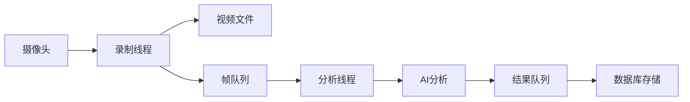

# FabricEye - AI验布系统 MVP

> 面向小微面料商的智能验布解决方案

## 🚀 快速开始

### 环境要求
- Python 3.10+
- Node.js 18+ (前端开发)
- Windows 10/11 或 Ubuntu 20.04+

### 1. 克隆项目

```bash
cd E:\myProject\FabricEye
```

### 2. 启动后端服务

```bash
cd backend

# 创建虚拟环境（推荐）
python -m venv venv
venv\Scripts\activate  # Windows
# source venv/bin/activate  # Linux/Mac

# 安装依赖
pip install -r requirements.txt

# 启动服务
uvicorn app.main:app --reload --host 0.0.0.0 --port 8000
```

后端服务将在 http://localhost:8000 运行

API文档：http://localhost:8000/docs

### 3. 启动前端服务（可选）

```bash
cd frontend

# 安装依赖
npm install

# 启动开发服务器
npm run dev
```

前端将在 http://localhost:5173 运行

---

## 📁 项目结构

```
FabricEye/
├── backend/                  # FastAPI后端
│   ├── app/
│   │   ├── main.py          # 应用入口
│   │   ├── core/            # 核心配置
│   │   │   ├── config.py    # 配置管理
│   │   │   └── database.py  # 数据库连接
│   │   ├── models/          # 数据库模型
│   │   │   ├── roll.py      # 布卷模型
│   │   │   ├── video.py     # 视频模型
│   │   │   └── defect.py    # 缺陷模型
│   │   ├── routers/         # API路由
│   │   │   ├── rolls.py     # 布卷API
│   │   │   ├── videos.py    # 视频API
│   │   │   └── defects.py   # 缺陷API
│   │   ├── services/        # 业务服务
│   │   │   ├── video_capture.py   # 视频采集
│   │   │   ├── streaming.py       # 流式处理
│   │   │   └── ai_analyzer.py     # AI分析
│   │   └── utils/           # 工具函数
│   └── requirements.txt     # Python依赖
├── frontend/                # Vue3前端（待补充）
├── docs/                    # 项目文档
│   ├── streaming-architecture.md  # 流式架构
│   └── api-design.md              # API设计
└── README.md               # 本文件
```

---

## 🔌 API接口

### 布卷管理

| 方法 | 路径 | 说明 |
|------|------|------|
| POST | `/api/rolls/` | 创建布卷 |
| GET | `/api/rolls/` | 获取布卷列表 |
| GET | `/api/rolls/{id}` | 获取布卷详情 |
| PUT | `/api/rolls/{id}` | 更新布卷 |
| DELETE | `/api/rolls/{id}` | 删除布卷 |

### 视频录制

| 方法 | 路径 | 说明 |
|------|------|------|
| POST | `/api/videos/start` | 开始录制 |
| POST | `/api/videos/stop` | 停止录制 |
| GET | `/api/videos/status/{id}` | 获取录制状态 |

### 缺陷管理

| 方法 | 路径 | 说明 |
|------|------|------|
| GET | `/api/defects/` | 获取缺陷列表 |
| GET | `/api/defects/roll/{roll_id}` | 获取指定布卷的缺陷 |
| PUT | `/api/defects/{id}/review` | 复核缺陷 |

### WebSocket

| 路径 | 说明 |
|------|------|
| `/ws/monitor/{roll_id}` | 实时监控（缺陷推送） |

---

## 🎯 核心功能

### 1. 双路流式处理



### 2. 支持缺陷类型

| 类型 | 中文 | 严重程度 |
|------|------|----------|
| hole | 破洞 | 严重 |
| stain | 污渍 | 中等 |
| color_variance | 色差 | 中等 |
| warp_break | 断经 | 严重 |
| weft_break | 断纬 | 严重 |

---

## ⚙️ 配置说明

### 后端配置

编辑 `backend/app/core/config.py`：

```python
# 数据库
DATABASE_URL = "sqlite+aiosqlite:///./fabric_eye.db"

# 视频存储
VIDEO_STORAGE_PATH = "./storage/videos"
SNAPSHOT_STORAGE_PATH = "./storage/snapshots"

# AI分析
ANALYSIS_INTERVAL = 1.0  # 每秒分析1帧
AI_API_KEY = "your-deepseek-api-key"
```

---

## 🐳 Docker部署

### 使用Docker Compose

```bash
# 构建并启动
docker-compose up -d

# 查看日志
docker-compose logs -f

# 停止
docker-compose down
```

---

## 📊 项目状态

### 已完成 ✅
- [x] 项目架构设计
- [x] FastAPI后端框架
- [x] 数据库模型设计
- [x] 视频采集服务
- [x] 流式处理引擎
- [x] AI分析服务（Mock）
- [x] RESTful API
- [x] WebSocket实时通信

### 进行中 🏃
- [ ] 前端界面开发
- [ ] DeepSeek-VL API集成
- [ ] 报告生成功能
- [ ] 系统集成测试

### 待开发 📋
- [ ] 多面料类型支持
- [ ] 缺陷类别扩展
- [ ] 模型训练迁移
- [ ] SaaS平台部署

---

## 📝 开发日志

### Phase 1: 基础架构（已完成）
- 搭建FastAPI后端框架
- 设计SQLite数据库
- 配置项目结构

### Phase 2: 核心功能（进行中）
- 实现视频采集服务
- 实现双路流式处理
- 实现AI分析服务
- 实现API路由

### Phase 3: 产品化（待开始）
- 开发Vue3前端
- 集成AI大模型API
- 实现报告生成
- 系统集成测试

---

## 🤝 贡献指南

1. Fork项目
2. 创建特性分支：`git checkout -b feature/xxx`
3. 提交更改：`git commit -m 'Add xxx'`
4. 推送分支：`git push origin feature/xxx`
5. 提交Pull Request

---

## 📄 许可证

MIT License

---

## 📞 联系方式

如有问题，请提交Issue或联系项目维护者。

---

**FabricEye - 让每一卷布都有AI守护** 🤖✨
