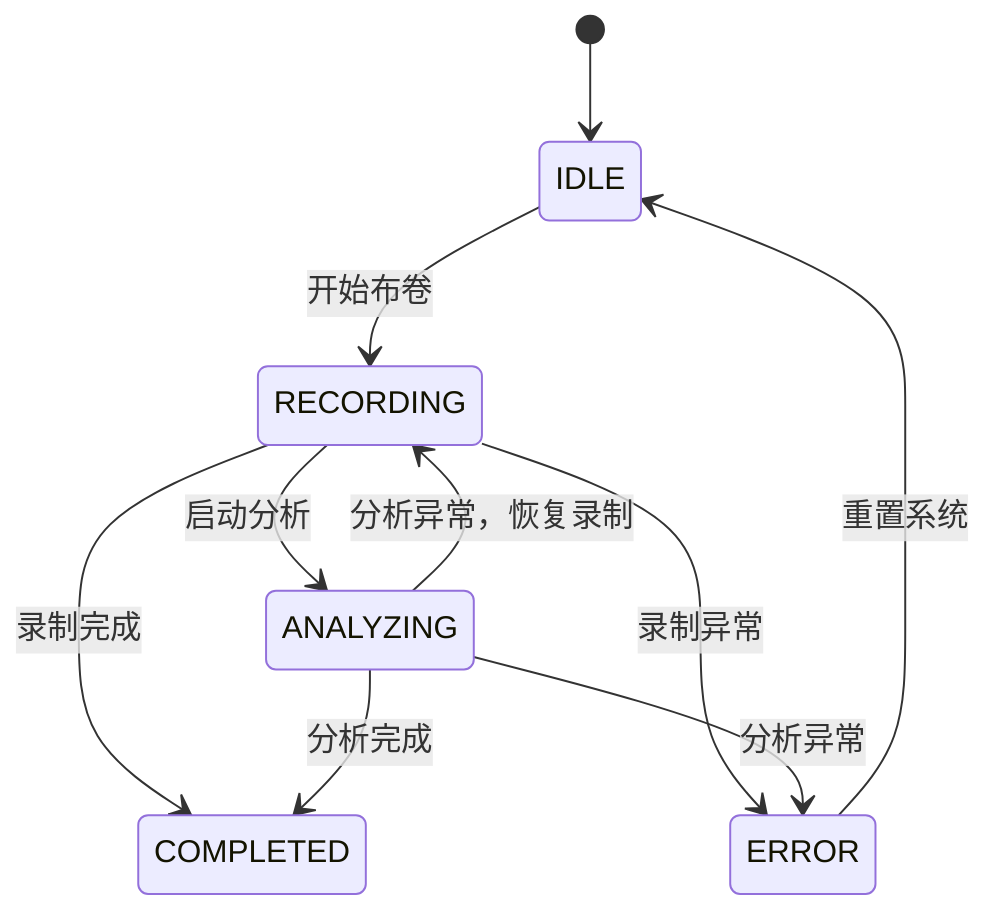

# FabricEye 流式处理架构文档

## 1. 系统概述

FabricEye 采用双路并发架构，实现视频录制与 AI 缺陷检测的实时并行处理。该架构旨在确保：
- 视频录制的稳定性不受 AI 分析失败的影响
- AI 分析能够及时处理视频帧，检测缺陷
- 系统具备良好的可扩展性和容错能力

## 2. 双路架构详细说明

系统采用两条独立但协同工作的处理路径：

### 2.1 录制线程 (Recording Thread)

**职责**：负责视频流的采集和持久化

**核心功能**：
- 从摄像头/视频源获取视频帧
- 将视频帧写入磁盘（AVI/MP4 格式）
- 记录视频元数据（时长、帧率、分辨率）
- 同步帧时间戳用于后续分析

**技术要点**：
- 使用 OpenCV (`cv2.VideoWriter`) 进行视频编码
- 采用固定帧率（例如 30 FPS）确保时间同步
- 关键帧（I帧）间隔设置保证视频可检索

### 2.2 分析线程 (Analysis Thread)

**职责**：负责实时缺陷检测

**核心功能**：
- 从帧队列获取视频帧
- 调用 AI 模型进行缺陷检测
- 将检测结果写入结果队列
- 生成缺陷快照（可选）

**技术要点**：
- 使用异步推理优化吞吐量
- 批量处理提高 GPU 利用率
- 结果后处理（Non-Maximum Suppression）

### 2.3 数据流图

```mermaid
graph TD
    subgraph "视频源"
        Camera[摄像头/视频文件]
    end

    subgraph "录制路径"
        FrameGrabber[帧采集器]
        VideoWriter[视频写入器]
        FrameQueue[帧队列]
    end

    subgraph "分析路径"
        FrameConsumer[帧消费者]
        AIProcessor[AI缺陷检测器]
        ResultQueue[结果队列]
    end

    subgraph "存储层"
        VideoStorage[视频文件存储]
        DefectDB[缺陷数据库]
    end

    subgraph "API层"
        APIServer[FastAPI服务器]
    end

    Camera --> FrameGrabber
    FrameGrabber --> VideoWriter
    FrameGrabber --> FrameQueue
    FrameQueue --> FrameConsumer
    FrameConsumer --> AIProcessor
    AIProcessor --> ResultQueue
    VideoWriter --> VideoStorage
    ResultQueue --> DefectDB
    DefectDB --> APIServer
    VideoStorage --> APIServer
```



## 3. 队列设计

### 3.1 帧队列 (Frame Queue)

**用途**：解耦录制和分析两个线程

**设计规格**：
```python
frame_queue = queue.Queue(maxsize=100)  # 最大缓冲 100 帧
```

**队列元素结构**：
```python
@dataclass
class FrameData:
    frame: np.ndarray          # 原始帧数据
    timestamp: float           # 帧时间戳（秒）
    frame_index: int          # 帧序号
    roll_id: int              # 关联布卷ID
```

**流量控制策略**：
- **背压机制**：当队列满时，录制线程暂停入队，防止内存溢出
- **超时机制**：入队/出队设置超时（默认 1 秒），超时视为异常

### 3.2 结果队列 (Result Queue)

**用途**：传递 AI 检测结果

**设计规格**：
```python
result_queue = queue.Queue(maxsize=1000)  # 最大缓冲 1000 个检测结果
```

**队列元素结构**：
```python
@dataclass
class DefectResult:
    roll_id: int              # 关联布卷ID
    video_id: int             # 关联视频ID
    defect_type: str          # 缺陷类型
    confidence: float         # 置信度 (0-1)
    position_meter: float     # 位置（米）
    timestamp: float          # 视频时间戳（秒）
    bbox: tuple               # 边界框 (x1, y1, x2, y2)
    snapshot_path: str | None # 快照路径
```

## 4. 延迟控制策略

### 4.1 延迟目标

| 指标 | 目标值 | 说明 |
|------|--------|------|
| 帧处理延迟 | < 50ms | 单帧从采集到进入队列 |
| AI 推理延迟 | < 100ms | 单帧 AI 推理时间 |
| 端到端延迟 | < 500ms | 从录制到结果可用 |

### 4.2 优化策略

1. **帧采样**
   - 非所有帧都进行分析（例如每 5 帧分析 1 帧）
   - 根据布料移动速度动态调整采样率

2. **异步处理**
   - 录制和分析完全异步
   - 使用 `ThreadPoolExecutor` 或 `ProcessPoolExecutor`

3. **GPU 批处理**
   - 积累若干帧后批量推理
   - 提高 GPU 利用率

4. **优先级队列**
   - 关键帧（特定间隔）优先处理
   - 高置信度检测结果优先写入数据库

## 5. 错误恢复机制

### 5.1 录制线程错误

| 错误类型 | 处理策略 |
|----------|----------|
| 摄像头断开 | 暂停录制，尝试重连（3次），告警 |
| 磁盘空间不足 | 停止录制，告警，保存当前视频 |
| 写入失败 | 回退到临时文件，标记视频状态为 "failed" |

### 5.2 分析线程错误

| 错误类型 | 处理策略 |
|----------|----------|
| AI 模型加载失败 | 记录错误日志，跳过该帧，继续处理 |
| 推理超时 | 跳过该帧，标记超时计数器 |
| 内存溢出 | 减少批处理大小，清空队列，重置状态 |

### 5.3 队列异常

| 异常类型 | 处理策略 |
|----------|----------|
| 队列为空 | 等待（带超时），超时后跳过 |
| 队列满 | 阻塞写入（带超时），超时后丢弃最旧帧 |
| 队列损坏 | 重建队列，记录错误 |

### 5.4 状态恢复



## 6. 并发安全考虑

### 6.1 线程隔离

- **录制线程**：仅负责 I/O 操作（视频写入）
- **分析线程**：仅负责计算（AI 推理）
- **主线程**：协调和状态管理

### 6.2 共享资源

| 资源 | 访问方式 | 保护机制 |
|------|----------|----------|
| 帧队列 | 生产者-消费者 | `queue.Queue` 线程安全 |
| 结果队列 | 生产者-消费者 | `queue.Queue` 线程安全 |
| 布卷状态 | 多线程读写 | `threading.Lock` 或数据库事务 |
| 视频文件 | 录制线程独占 | 无需保护 |

### 6.3 死锁预防

1. **固定加锁顺序**：始终按相同顺序获取多个锁
2. **限时锁**：使用 `threading.Lock(timeout=...)` 防止永久阻塞
3. **避免嵌套锁**：尽量减少锁的嵌套层级
4. **资源ordered获取**：数据库连接、文件句柄等按固定顺序获取

### 6.4 示例代码结构

```python
import threading
import queue
from dataclasses import dataclass
from typing import Optional
import numpy as np


@dataclass
class FrameData:
    frame: np.ndarray
    timestamp: float
    frame_index: int
    roll_id: int


class StreamingEngine:
    def __init__(self):
        self.frame_queue: queue.Queue[FrameData] = queue.Queue(maxsize=100)
        self.result_queue: queue.Queue = queue.Queue(maxsize=1000)
        self._running = False
        self._lock = threading.Lock()
        
    def start_recording(self, roll_id: int):
        with self._lock:
            if self._running:
                raise RuntimeError("Already running")
            self._running = True
            # 启动录制和分析线程...
            
    def stop_recording(self):
        with self._lock:
            self._running = False
            # 等待线程结束...
```

## 7. 监控与告警

### 7.1 关键指标

- 帧队列深度（反映分析能力）
- AI 推理延迟（P50/P95/P99）
- 缺陷检测率
- 错误次数/错误率

### 7.2 告警规则

| 指标 | 阈值 | 动作 |
|------|------|------|
| 帧队列深度 | > 80 | 告警：分析能力不足 |
| AI 推理延迟 | > 200ms | 告警：推理超时 |
| 连续错误 | > 10 次 | 停止分析，检查模型 |
| 磁盘空间 | < 1GB | 告警：存储不足 |

## 8. 扩展性设计

### 8.1 多布卷并行

通过为每个布卷创建独立的 `StreamingEngine` 实例，支持多路并行处理：

```python
engines: dict[int, StreamingEngine] = {}  # roll_id -> engine

def start_roll(roll_id: int):
    engine = StreamingEngine()
    engines[roll_id] = engine
    engine.start()
```

### 8.2 分布式部署

- 帧队列可替换为 Redis Queue
- 分析Worker可部署为独立服务
- 使用消息队列（如 RabbitMQ）进行任务分发

## 9. 附录：配置参数

```python
# 流式处理配置
STREAMING_CONFIG = {
    "frame_queue_size": 100,
    "result_queue_size": 1000,
    "frame_sample_rate": 5,        # 每5帧分析1帧
    "max_retry_attempts": 3,
    "queue_timeout": 1.0,          # 秒
    "analysis_batch_size": 4,
}

# 视频配置
VIDEO_CONFIG = {
    "fps": 30,
    "codec": "mp4v",
    "resolution": (1920, 1080),
}

# AI 配置
AI_CONFIG = {
    "model_path": "models/defect_detector.onnx",
    "confidence_threshold": 0.5,
    "nms_threshold": 0.3,
}
```
